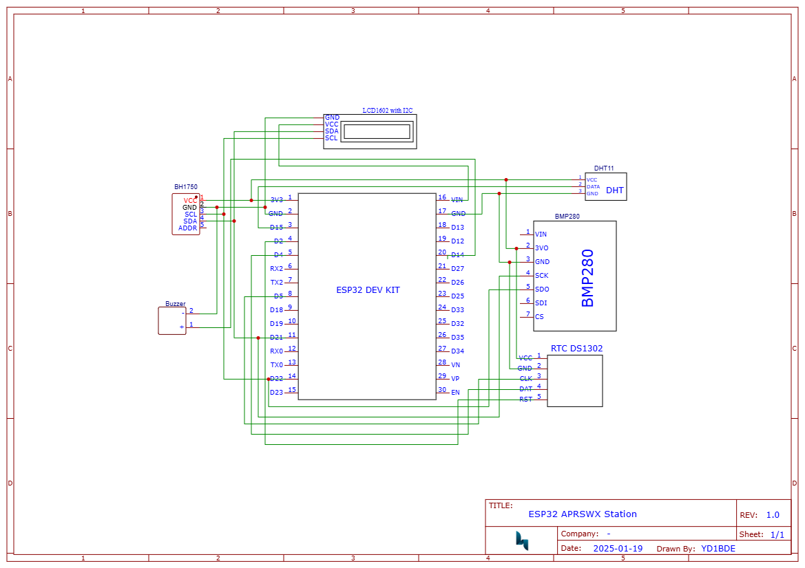
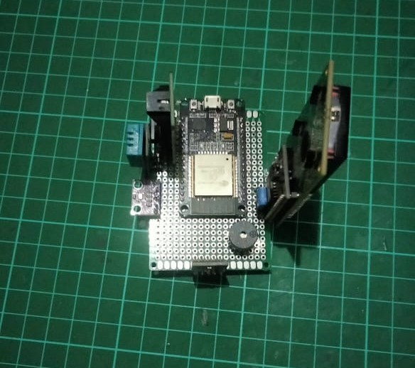

# ESP32-Based-APRS-Weather-Station
This project implements APRS-IS (Automatic Packet Reporting System-Internet Service) and the MQTT protocol using an ESP32 board. The purpose of this project is to transmit measured weather parameters through these protocols. Before we go to the reporting system, let's talk about the hardware first.
# HARDWARE
So, there are at least 4 parameters measured by this system with nodemcu ESP32 dev module as the main board. Those parameters including temperature, humidity, pressure and irradiance. The temperature and relative humidity are measured with a DHT11 sensor, air pressure with a BMP280 sensor (althought this sensor also could do temperature measurement), and solar irradiance with a BH1750 sensor. The system is also equipped with an RTC DS1302 module for NTP time backup and an active buzzer for notifications when the package uploaded. All components then mounted to a 5 x 7 cm holed empty universal pcb, make it small and compact.

Here are the components list i used for this kit :
- NodeMCU ESP32 DEV KIT 32pins;
- 5 x 7 cm holed empty universal pcb;
- DHT11 sensor;
- BMP280 sensor;
- BH1750 sensor;
- Active Buzzer;
- lcd 16x2 I2C;
- some jumper wires.

Here is the schematic i made with EasyEDA, 

I used ESP32 with 32pins on it, the board mounted to the universal pcb first, followed by all the components on each side. For the lux meter BH1750 sensor, i mounted it on the top op board position, the BHP and DHT sensor on the same side, and the lcd on the other side. The usb port position of the main board also placed down.

The BMP, BH1750, and LCD using I2C communication pin with different address, BMP actually has two communication methods, but i use the I2C addres due to ease building (this sensor using 0x76 I2C addres for communication addrress), LCD using 0x27 address, then the addres pin on BH1750 i jumped into a GND pin to make 0x23 addres as noted as on the sensor's documentationn. All the VCC components connected to 3.3V pin except the LCD connected to VIN pin. The RTC using Three-Wire communication through pin 5, 4, 2 for the CLK, DATE, and RST.
# FIRMWARE
Let's simplify the algorithm of the firmware first, actually this system has three main program, the display program, APRS package uploader, and MQTT uploader. This device will display the measured sensor values for every 5 seconds and The APRS and MQTT package will be uploaded every 5 minutes(you can change the setting later on the main program). The APRS package including the data of the sensors will be uploaded to APRS-Internet Service server as a report from an WX station, the MQTT package will be used to send the measurement values through the MQTT protocols integrated with Node-RED platform to stored the data in mySQL database then visualized on Grafana platform.

For time setting i used 2 methods using Network Time Client (NTP) and RTC for the backup. I assumed perhaps the NTP server may down sometime so the RTC will come to the rescue. When the NTP methods broken the device will used the RTC as the timer device. Although this device need Internet connection through a builtin WiFi module on the board, but this device will still working without connection, for the future i perhaps add a sdcard module for the storage backup.

let's talk about the code,

    <pre><code>
int sensoraprs[5];
sensoraprs[0] = dht.readTemperature(true);
sensoraprs[1] = dht.readHumidity();
if (bmp.takeForcedMeasurement()) {
    sensoraprs[2] = bmp.readPressure() / 10;
} else {
    Serial.println("Forced BMP measurement failed!");
}
sensoraprs[3] = Lumos.readLightLevel() / 126.7;
sensoraprs[4] = dht.readTemperature();
    </code></pre>

Here is how i measured the the weather parameters. BMP280 read the pressure on Pascal (Pa) unit, but i want to get the pressure in mbar unit so we need to devided it with 100 to get pressure in milibar, also with the irradiance with BH1750, the sensor read the light in lux unit, but we need to convert it tp W/m^2 unit. We did this conversion because the APRS package need those units to confirm our report.
Talk about the APRS, APRS-IS (Automatic Packet Reporting System-Internet Service) is an internet-based network that connects various APRS radio stations, enabling the real-time transmission of data, including weather information. This system allows amateur radio operators to send and receive data packets that contain various types of information, such as location tracking and meteorological conditions. By facilitating the sharing of real-time data, APRS-IS enhances the accessibility and utility of weather information for both individuals and organizations.

WXStations are personal weather stations that collect local meteorological data and send it to the CWOP (Citizen Weather Observer Program) using APRS. These stations can range from simple home setups to more advanced installations. By transmitting their data to CWOP, WXStations contribute to a larger network that aggregates weather information for use by meteorological agencies and researchers, thereby acting as a bridge between individual weather stations and broader weather monitoring systems.

The integration of WXStations with APRS-IS provides significant benefits, including real-time weather monitoring and increased community engagement in data collection. The data collected through CWOP is utilized by various organizations, including the National Weather Service, to improve the accuracy of weather predictions and models. Users can access this data through platforms like findu.com, which organizes and displays weather information from multiple sources, ensuring that the data is reliable and useful for forecasting and research purposes.

To send APRS messages, there are several requirements that must be met regarding the packet format. The APRS packet format must adhere to specific specifications in order to be processed and received correctly by the APRS system.
