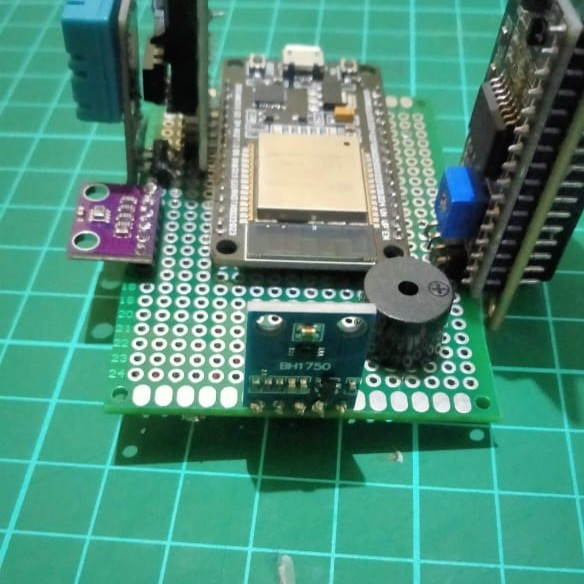
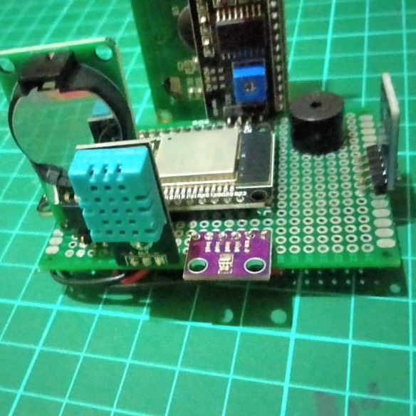

# ESP32-Based-APRS-Weather-Station
This project implements APRS-IS (Automatic Packet Reporting System-Internet Service) and the MQTT protocol using an ESP32 board. The purpose of this project is to transmit measured weather parameters through these protocols. Before we go to the reporting system, let's talk about the hardware first.
# HARDWARE
So, there are at least 4 parameters measured by this system with nodemcu ESP32 dev module as the main board. Those parameters including temperature, humidity, pressure and irradiance. The temperature and relative humidity are measured with a DHT11 sensor, air pressure with a BMP280 sensor (althought this sensor also could do temperature measurement), and solar irradiance with a BH1750 sensor. The system is also equipped with an RTC DS1302 module for NTP time backup and an active buzzer for notifications when the package uploaded. All components then mounted to a 5 x 7 cm holed empty universal pcb, make it small and compact.

Here are the components list i used for this kit :
- NodeMCU ESP32 DEV KIT 32pins;
- 5 x 7 cm holed empty universal pcb;
- DHT11 sensor;
- BMP280 sensor;
- BH1750 sensor;
- Active Buzzer;
- lcd 16x2 I2C;
- some jumper wires.

Here is the schematic i made with EasyEDA, 

I used ESP32 with 32pins on it, the board mounted to the universal pcb first, followed by all the components on each side. For the lux meter BH1750 sensor, i mounted it on the top op board position, the BHP and DHT sensor on the same side, and the lcd on the other side. The usb port position of the main board also placed down.

The BMP, BH1750, and LCD using I2C communication pin with different address, BMP actually has two communication methods, but i use the I2C addres due to ease building (this sensor using 0x76 I2C addres for communication addrress), LCD using 0x27 address, then the addres pin on BH1750 i jumped into a GND pin to make 0x23 addres as noted as on the sensor's documentationn. All the VCC components connected to 3.3V pin except the LCD connected to VIN pin. The RTC using Three-Wire communication through pin 5, 4, 2 for the CLK, DATE, and RST.
# FIRMWARE
