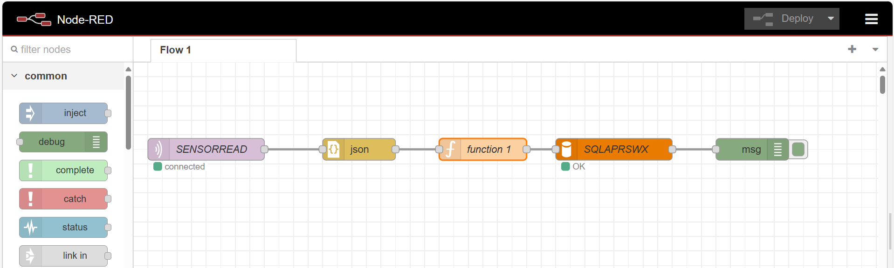
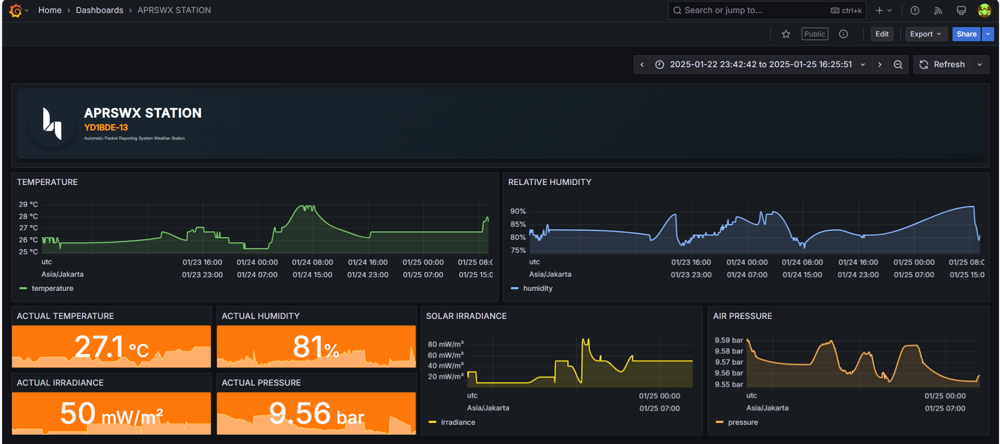

# ESP32-Based-APRS-Weather-Station
This project implements APRS-IS (Automatic Packet Reporting System-Internet Service) and the MQTT protocol using an ESP32 board. The purpose of this project is to transmit measured weather parameters through these protocols. Before we go to the reporting system, let's talk about the hardware first.
# HARDWARE
The system measures at least four parameters, using the NodeMCU ESP32 Dev module as the main board. These parameters include temperature, humidity, pressure, and irradiance. The temperature and relative humidity are measured using a DHT11 sensor, air pressure is measured with a BMP280 sensor (although this sensor can also measure temperature), and solar irradiance is measured with a BH1750 sensor. The system is also equipped with an RTC DS1302 module for NTP time backup and an active buzzer for notifications when a package is uploaded. All components are mounted on a 5x7 cm holed universal PCB, making it small and compact.

Here are the components list i used for this kit :
- ESP32 DEV KIT 30pins;
- 5 x 7 cm holed empty universal pcb;
- DHT11 sensor;
- BMP280 sensor;
- BH1750 sensor;
- 1302 RTC module;
- Active Buzzer;
- lcd 16x2 I2C;
- some jumper wires.

Here is the schematic i made with EasyEDA, 


I used the ESP32 with 30 pins on it, mounted the board to the universal PCB first, followed by the components on each side. For the BH1750 sensor, I mounted it on the top of the board. The BMP280 and DHT11 sensors are on the same side, and the LCD is on the other side. The USB port of the main board is also positioned at the bottom.

<p align="center">
    
</p>

The BMP, BH1750, and LCD using I2C communication pins with different addresses, BMP actually has two communication methods, but i use the I2C addres due to ease building (this sensor using 0x76 I2C addres for communication addrress), LCD using 0x27 address, then the addres pin on BH1750 i jumped into a GND pin to make 0x23 addres as noted as on the sensor's documentationn. All the VCC components connected to 3.3V pin except the LCD connected to VIN pin with 5v. The RTC using Three-Wire communication through pin 5, 4, 2 for the CLK, DATE, and RST.
# FIRMWARE
Let's simplify the algorithm of the firmware first, actually this system has three main programs, the display program, APRS package uploader, and MQTT uploader. This device will display the measured sensor values for every 10 seconds and The APRS and MQTT package will be uploaded every 5 minutes(you can change the setting later on the main program). The APRS package including the data of the sensors will be uploaded to APRS-Internet Service server as a report from an WX station, the MQTT package will be used to send the measurement values through the MQTT protocols integrated with Node-RED platform to stored the data in mySQL database then visualized on Grafana platform.

For time setting i used 2 methods using Network Time Client (NTP) and RTC for the backup. I assumed perhaps the NTP server may down sometime so the RTC will come to the rescue. When the NTP methods broken the device will used the RTC as the timer device. Although this device need Internet connection through a builtin WiFi module on the board, but this device will still working without connection, for the future i perhaps add a sdcard module for the storage backup.

Here is how i measured the the weather parameters and some conversion to get sensor values in a specific unit, BMP280 read the sir pressure on Pascal (Pa) unit, but i want to get the pressure in mbar unit in 5 digit so we need to devided it with 10 to get pressure in 5 digit milibar, also with the irradiance with BH1750, the sensor read the light in lux unit, but we need to convert it to W/m^2 unit, I found [this FAQ question](https://ambientweather.com/support/question/view/id/1452/) said that most sources  agree on the 126.7 as a reasonable factor to use, and [this research](https://www.researchgate.net/publication/347362859_A_conversion_guide_solar_irradiance_and_lux_illuminance) about converting lux to irradiance, The analysis and measurement show the irradiance to illuminance conversion factor is 122 ± 1 lx for outdoor natural sunlight, We did this conversion because the APRS package need those units to confirm our our measured values as a report, we talk about this later.


```cpp
int sensoraprs[5];
sensoraprs[0] = dht.readTemperature(true);
sensoraprs[1] = dht.readHumidity();
if (bmp.takeForcedMeasurement()) {
    sensoraprs[2] = bmp.readPressure() / 10;
} else {
    Serial.println("Forced BMP measurement failed!");
}
sensoraprs[3] = Lumos.readLightLevel() / 126.7;
sensoraprs[4] = dht.readTemperature();
```


Talk about the APRS, APRS-IS (Automatic Packet Reporting System-Internet Service) is an internet-based network that connects various APRS radio stations, enabling the real-time transmission of data, including weather information. This system allows amateur radio operators to send and receive data packets that contain various types of information, such as location tracking and meteorological conditions. By facilitating the sharing of real-time data, APRS-IS enhances the accessibility and utility of weather information for both individuals and organizations.


WXStations are personal weather stations that collect local meteorological data and send it to the CWOP (Citizen Weather Observer Program) using APRS. These stations can range from simple home setups to more advanced installations. Actually there are two ways to send the report by a WXStation, first is using APRS-IS Server directly with 14580 port, second through the radio transmission to an APRS digipeater or APRS-IS gate, this device just only send the report through internet service directly. But in order to send APRS messages, there are several requirements that must be met regarding the packet format. The APRS packet format must adhere to specific specifications in order to be processed and received correctly by the APRS system.


This image shows the format of the APRS package that we need to verify as a weather report. First, we need an amateur radio callsign, and the “-13” suffix indicates that this station is a weather station. We also need to send the station's location in the correct format. Currently, the device uses GPS input from the user (I may add a GPS module in the future). The report includes parameters such as wind direction, wind speed, temperature (in Fahrenheit), rain per hour, rain per day, humidity, air pressure, and luminosity, all in specific numerical formats. However, I don't measure wind or rain due to component limitations, but I hope to include all weather parameters in the future. To meet the standard formats, I performed the necessary conversions and formatting using the following block of code:

```cpp
// formatting parameter for CWOP APRS format
char temp[4];
sprintf(temp, "%03d", sensoraprs[0]);
String aprstemp = "t" + String(temp);

char hum[4];
sprintf(hum, "%03d", sensoraprs[1]);
String aprshum = "h" + String(hum);

char press[6];
sprintf(press, "%05d", sensoraprs[2]);
String aprspress = "b" + String(press);

char lux[4];
sprintf(lux, "%03d", sensoraprs[3]);
String aprslumi = "L" + String(lux);
  
// aprs message builder
String message = String(USER) + ">APRS,TCPIP*:=" + String(GPS) + 
                   String(aprswinddir) + String(aprswindspeed) + String(aprswindgust) +
                   aprstemp + String(aprsrainh) + String(aprsraind) + String(aprsrainm) + 
                   aprshum + aprspress + aprslumi + String(COMMENT) +
                   "T: " + String(sensoraprs[4]) + "°C" +
                   " RH: " + String(sensoraprs[1]) + "%" +
                   " P: " + String(sensoraprs[2]) + "mbar" +
                   " G: " + String(sensoraprs[3]) + "W/m^2";
```

I also add a block of code that to handle the situation when the sensor fails to read the parameters, and then return the values by default of the APRS format before. I also defined the default value like rain by "r..." and other parameters that i don't measure and still write the code on the message. The message after irradiance is a variable of comment that we can change as we like, i like to write the measured values again so i called the sensor values variable that i stored in an array again. 

To do the APRS uploader i use a library called [APRS-IS Lib](https://github.com/lora-aprs/APRS-IS-Lib) by Peter Buchegger. I also we need to register our callsign first to get a pass code for the APRS-IS network through [this page](https://aprs.do3sww.de/). Once the message is uploaded i added a notification through the lcd screen and a buzzer. To get know if our message received by the server i also added a block of code that can receive the mesage from the server so we can confirm if our message get received and verified by them.

# MQTT
Although all of the data stored in the database, as an owner i also want to store my own data in my own database. That's why i also send the data by MQTT protocols. I do this with a libray called [PubSubclient](https://pubsubclient.knolleary.net/) by Nick O'Leary,  though I still use a free broker to upload the data. The algorithm is the same: first, I collect and format the data, store it in variables, and then send it to the broker server with a unique topic. For notifications, I also added a notification when the data is sent.
```cpp
snprintf(payloadsensor, sizeof(payloadsensor),
         "[%lu, \"%s\", \"%s\", %.2f, %.2f, %.2f, %.2f]",
         epochTime, formattedTime, GPS, sensormqtt[4], sensormqtt[1], sensormqtt[2], sensormqtt[3]);
```
I send a total of seven variables in one message payload: time (in epoch format), formatted time, position, temperature, humidity, pressure, and irradiance, all in a unique topic. Before starting the system, I created an Ubuntu EC2 instance in AWS to run the Node-RED platform via public IP (port 1880) to parse and send the payload to a MySQL database, using the following flows.



The SENSORREAD node is used to subscribe to the MQTT topic from the broker to receive the package from the device. The JSON node is used to convert the payload into a JavaScript object format. After that, the MySQL node is used to insert the data into a table. The table is created using the following query:
```
var time = msg.payload[0];
var loc = "'" + msg.payload[2] + "'";
var temp = msg.payload[3];
var hum = msg.payload[4];
var press = msg.payload[5];
var irrad = msg.payload[6];
msg.topic = "INSERT INTO APRSWXStation (time, location, temperature, humidity, pressure, irradiance) " +
    "VALUES (" + time + " , " + loc + ", " + temp + " , " + hum + ", " + press + ", " + irrad + ");";
return msg;
```
before that i ofcourse started the mySQL service on my Ubuntu EC2, made a database and a table contains columns that i want to fill such as time, location, and the sensor values. After that i add a mySQL node to the flows, fill the Host with the Public ip of my instance, and the port with mySQL port 3306. Last but not least i add a debug node to know if the payload was store in the database or not.

Once the payload was sended and stored to the database, then i made a grafana cloud to visualize the data through a page that can viewed by others. First i connected the data source to my mySQL database, then i made a dashboard contains some graphics that visualized all of my data i have. I also added a header to give an information about my station.



My public dashboard until this documentation writed, accesscible via [this page](https://hasboy.grafana.net/public-dashboards/6d22b4d4ccd94612b9d01ee24185d1a6?orgId=1). Don't mind the irradiance value, i still placed this device in an indoor room, still searching a box that fit-well this tiny components, or maybe  will desain the 3D model for the box next.
